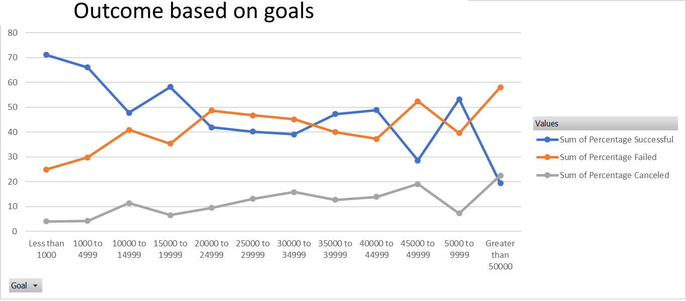
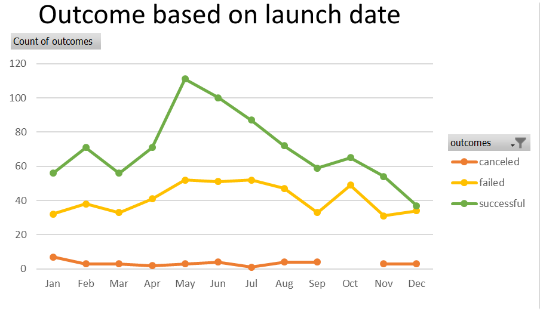

# Analysis of Kickstarter Campaigns
### Course
Performing analysis on kickstarter campaigns to analyse trends to help a playwright set up her own successful campaign.
We found out that the most successful campaigns were the ones for theater/plays, and the outome could depend on different factors, notably launch date (May/June) and duration of the campaign (1 month).

At the end , we also looked briefly at musicals in GB for a future project by the playwright.

### Challenge
We found out that the plays with a goal under 5,000 have far more chance of being successful (aroundf 70%). And for any goal over 5,000, there  is often less than 50% chance to succeed.

Looking at the outcomes of all forms of theater, we can definitely see that the best moinths to launch a campaign are May, then June.

To sum up, the best kickstarter campaign will be a 1-month campaign for a play with a goal under $5,000 and a launch date in May.
