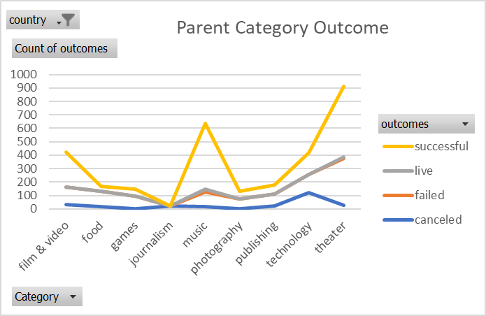
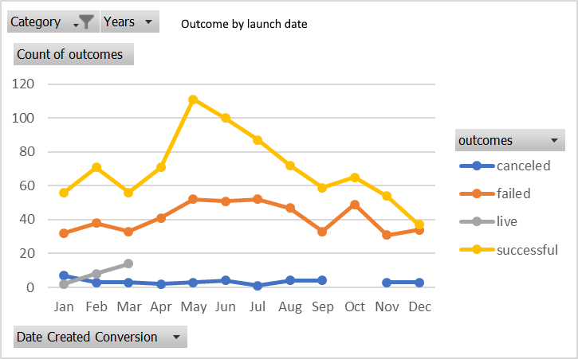
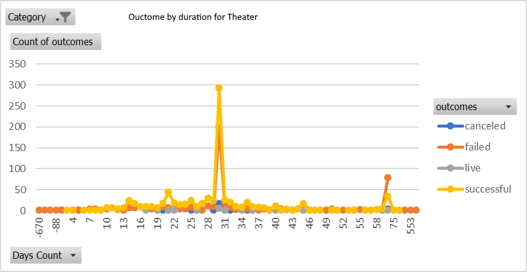

# Analysis of Kickstarter Campaigns

Performing analysis on kickstarter campaigns to analyse trends to help a playwright set up her own successful campaign.
We found out that the most successful campaigns were the ones for theater/plays, and the outome could depend on different factors, notably launch date (June) and duration of the campaign (1 month).

At the end , we also looked briefly at musicals in GB for a future project by the playwright.

